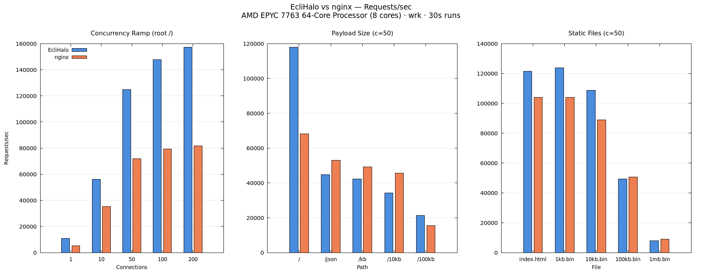

<!> This readme is still in works as software is not production ready and is not deployed on production or canary stagging <Dev @Memo 25><!>

  

# EcliHalo

EcliHalo is lightweight reverse proxy for EcliPanel and its systems.
It features SIGHUP reload, load balancing, health checks, websocket webrtc and gRPC tunneling.

It is supposed to be better than NGINX for EcliPanel work and handles up to 106% more RPS than NGINX.

Documentation can be found at: https://ecli.app/docs/eclihalo

## Load balancing 
<Dev @Memo 23> 
round_robin is perfect for stateless APIs
least_connections is perfect for long lived requests
ip_hash should be used for sticky sessions such as websockets
random is well, good luck. <Dev @Memo 24>

NOTE: Unhealthy upstreams are TCP probed every 10 seconds and are auto removed from rotation in case of issues

## Benchmark
Here are current http benchmark (see bench.sh code)
Benchmark was made by Claude Opus and is currently primary source of benchmarking until new proper one will be made

Here is graph, higher = better.

  

